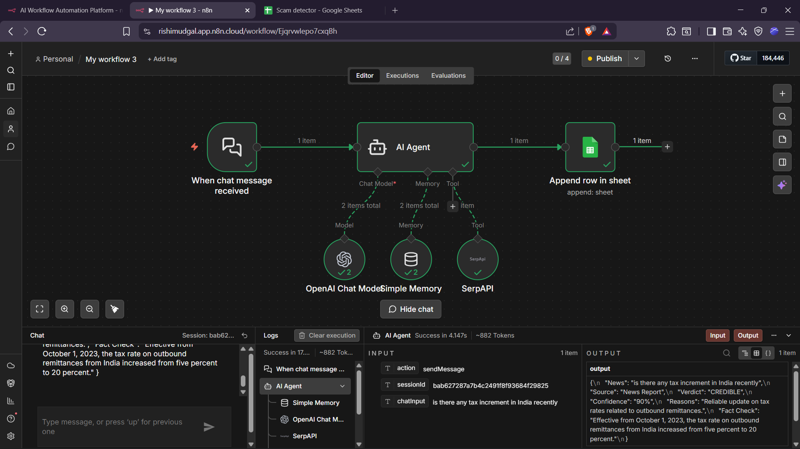
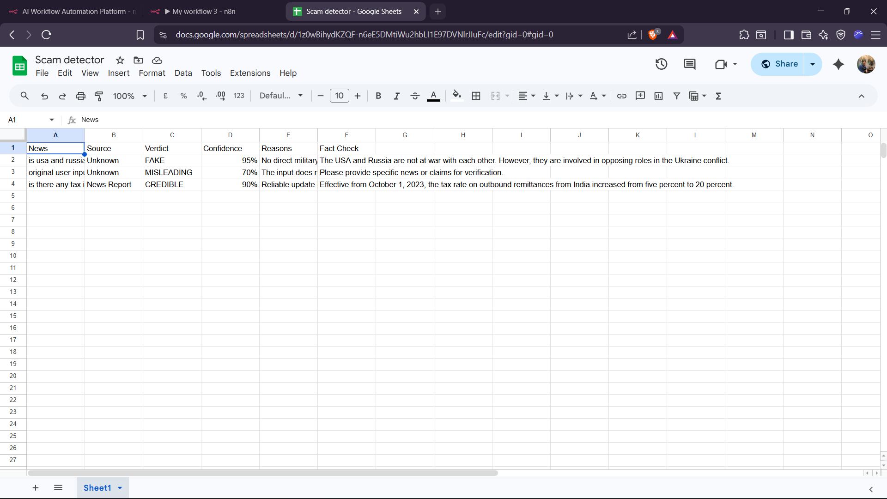

# 🛡️ AI Fake News Detector

An AI-powered workflow built using **n8n** that helps detect whether a news claim, viral message, suspicious headline, or circulating information is **FAKE**, **MISLEADING**, or **CREDIBLE**.

This project combines **AI reasoning + web verification + automated logging** into one workflow.

---

## 🚀 Features

✅ Accepts user text input
✅ Uses AI Agent for analysis
✅ Uses SerpAPI for live web verification
✅ Generates verdict with confidence score
✅ Explains reasons behind decision
✅ Saves every result to Google Sheets
✅ Built fully with no-code/low-code automation (n8n)

---

## 🧠 How It Works

User Input → AI Agent → Web Search Verification → Final Verdict → Google Sheets Log

---

## 📌 Output Example

```text
News: Is USA at war with Russia?

Verdict: FAKE
Confidence: 95%

Reason:
No official declaration or verified reports support this claim.

Fact Check:
USA and Russia are geopolitical rivals but not officially at war.
```

---

## 🛠️ Tech Stack

* n8n
* OpenAI API
* SerpAPI
* Google Sheets
* Workflow Automation

---

## 📂 Project Files

```text
workflow.json        → Importable n8n workflow
screenshots/         → Workflow + Output screenshots
README.md            → Project documentation
```

---

## 📸 Screenshots

### Workflow



### Google Sheets Output



---

## 🔧 How To Use

1. Clone this repository
2. Import `workflow.json` into n8n
3. Connect your:

   * OpenAI credentials
   * SerpAPI key
   * Google Sheets account
4. Run the workflow
5. Enter a suspicious news claim for analysis

---

## 🌟 Why I Built This

Misinformation spreads rapidly online. This project was built to explore how AI automation can help people quickly verify doubtful news and suspicious claims.

---

## 🔮 Future Improvements

* Browser Extension
* WhatsApp fact-check bot
* Multi-language support
* Confidence visualization dashboard
* Source credibility scoring

---

## 👨‍💻 Author

**Rishi Mudgal**

---

## ⭐ If you like this project, consider starring the repo!
